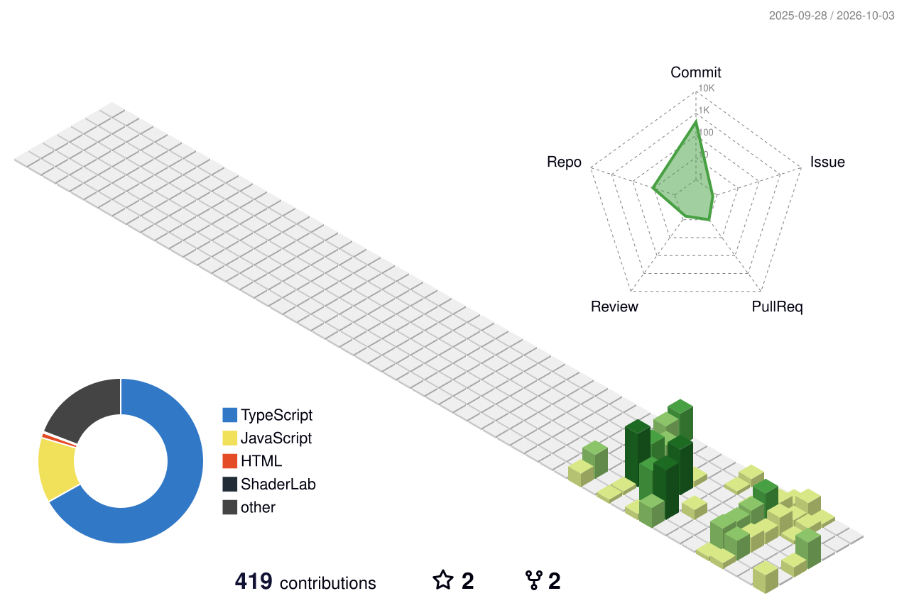

# 👋 Hi, I'm Clark

  I enjoy building functional web applications, learning new technologies,
  and turning ideas into real-world software.

  

  

---

## 🚀 About Me

- 🎓 Currently studying **Information Technology**
- 💻 Interested in **Full-Stack Web Development**
- 🛠️ Building practical systems and web applications
- 🤖 Using AI-assisted development to learn and build faster
- 📚 Constantly learning new technologies
- 🚀 Currently working on **JMAC Enterprise**

---

## 🔭 Currently Building

### 🏢 JMAC Enterprise

**A unified business management platform**

JMAC Enterprise is designed to connect multiple business systems into one
platform.

| System | Description |
| :--- | :--- |
| 🛒 **POS** | Point of Sale & Inventory |
| 👥 **HRMS** | Human Resources Management |
| 💰 **FMS** | Financial Management System |

---

## 🧰 Languages & Tools

### Frontend

  

### Backend & Database

  

### Tools

---

## 📌 Featured Projects

---

## 📊 GitHub Statistics

  

---

## 🐍 Contribution Activity

<picture>
  <source
    media="(prefers-color-scheme: dark)"
    srcset="https://raw.githubusercontent.com/clxrrK/clxrrK/output/github-snake-dark.svg"
  />

  <source
    media="(prefers-color-scheme: light)"
    srcset="https://raw.githubusercontent.com/clxrrK/clxrrK/output/github-snake.svg"
  />

  
</picture>

---

## 🌌 3D Contribution Calendar

---

## 📫 Connect With Me

---

### 💙 Build. Learn. Improve. Repeat.

 

